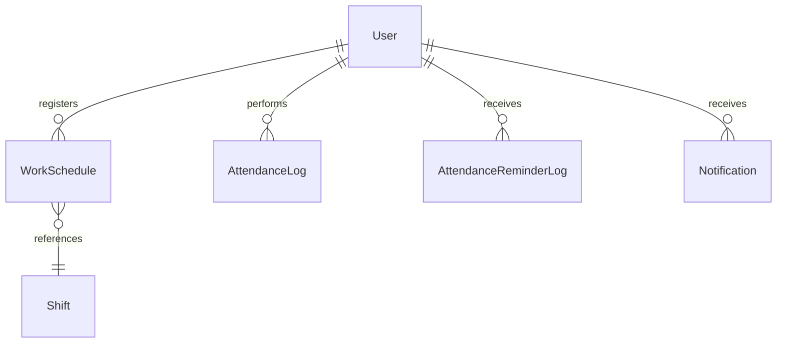
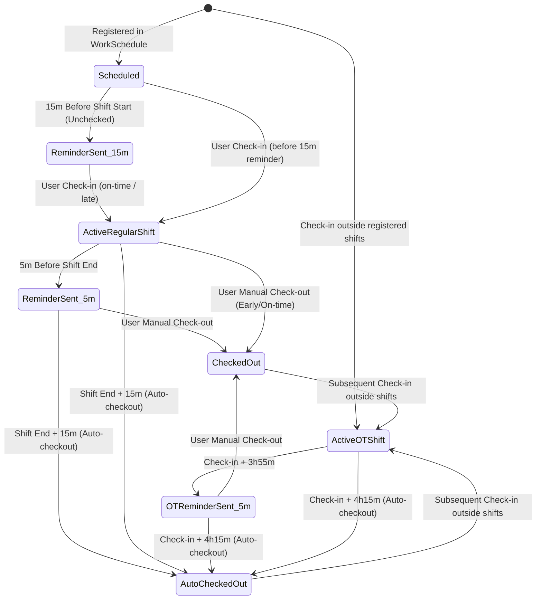

# Data Model: Shift-Based Attendance Notifications, Auto-Checkout & OT Management

**Branch**: `009-attendance-shift-reminders`  
**Date**: 2026-08-04  

## Entity Relationship Overview

---

## 1. AttendanceReminderLog (New Entity)

Stores records of dispatched reminders and automated checkout actions to guarantee idempotency across scheduler iterations.

### Table: `attendance_reminder_logs`

| Field | Type | Constraints | Description |
|-------|------|-------------|-------------|
| `id` | Integer | Primary Key, Auto Increment | Unique record ID |
| `employee_name` | String(255) | Indexed, Not Null | Employee username / full name |
| `date` | String(50) | Indexed, Not Null | Date formatted as `YYYY-MM-DD` |
| `shift_identifier` | String(100) | Not Null | Shift ID, name, or `"OT_<log_id>"` |
| `event_type` | String(50) | Not Null | `checkin_reminder_15m`, `checkout_reminder_5m`, `auto_checkout_15m`, `ot_checkout_reminder_5m`, `ot_auto_checkout_15m` |
| `details` | Text | Nullable | Optional JSON/text details |
| `triggered_at` | DateTime | Default `utcnow` | Timestamp when event was executed |

**Unique Index**: `ix_attendance_reminders_unique` on `(date, employee_name, shift_identifier, event_type)`

---

## 2. AttendanceLog (Updated Attributes)

### Table: `attendance_logs`

Existing table with enhanced status & note metadata support:

| Field | Type | Description / Allowed Values |
|-------|------|------------------------------|
| `id` | Integer | Primary Key |
| `employee_name` | String(255) | Normalized crew / user name |
| `avatar` | String(500) | Avatar URL |
| `action` | String(50) | `"check-in"` or `"check-out"` |
| `time` | String(50) | Time formatted as `"HH:MM"` |
| `date` | String(50) | Date formatted as `"YYYY-MM-DD"` |
| `status` | String(50) | `"on-time"`, `"late"`, `"ot"`, `"wfh"`, `"business"`, `"auto-checkout"`, `"early-leave"` |
| `note` | String(255) | Notes (e.g. `"Office"`, `"OT (Ca 4h)"`, `"Hệ thống tự động check-out (quá thời gian ca 15 phút)"`) |
| `lat` / `lng` | Float | GPS coordinates (null for system auto-checkout) |
| `created_at` | DateTime | System timestamp |

---

## 3. WorkSchedule & Shift Reference Model

### `work_schedules`
- `employee_name`: String
- `week_start_date`: String (Monday of the week `YYYY-MM-DD`)
- `schedule_data`: JSON object `{"2026-08-04": ["morning", "afternoon"]}` or shift IDs `{"2026-08-04": ["1", "2"]}`

### `shifts`
- `name`: String (`"Ca Sáng"`, `"Ca Chiều"`, etc.)
- `start_time`: String (`"08:30"`)
- `end_time`: String (`"12:00"`)
- `break_time`: String (`"12:00 - 13:30"`)
- `days`: String (`"T2, T3, T4, T5, T6, T7"`)

---

## State Transition Workflow

